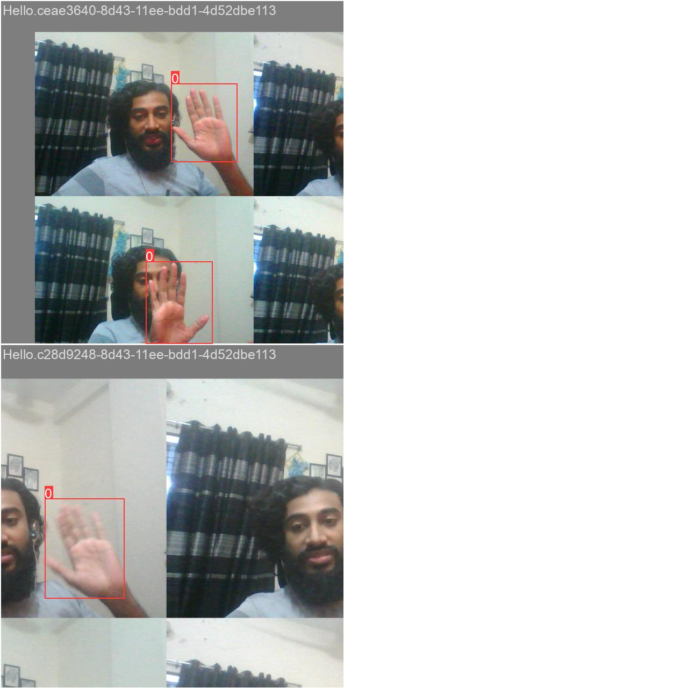
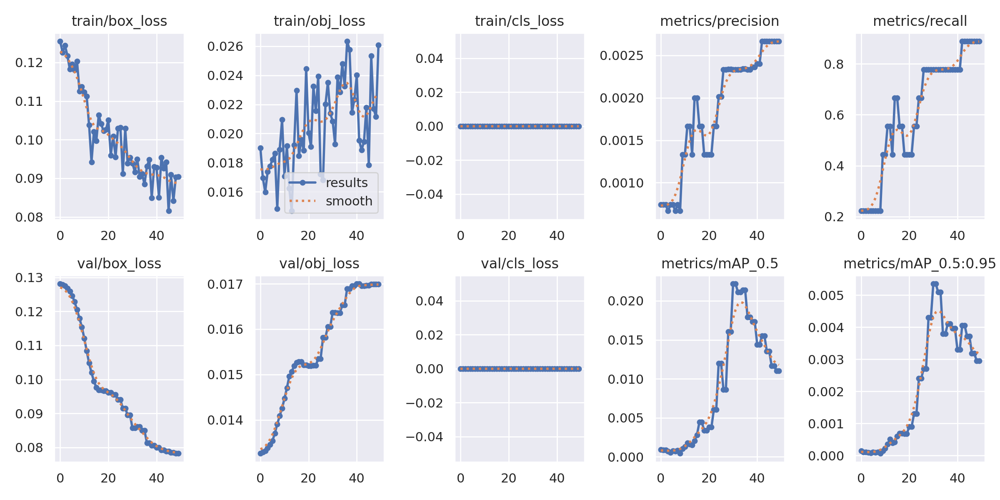
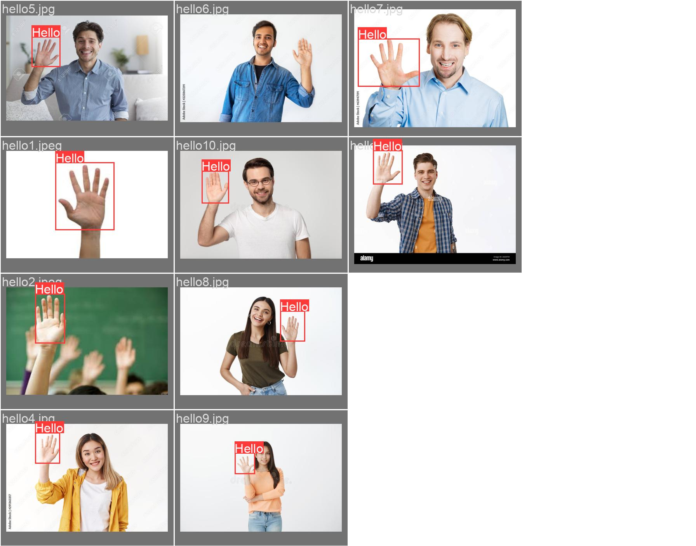

# Sign Language Detection using YOLOv5





## Introduction
The Sign Language Detection project focuses on the recognition and interpretation of hand gestures within sign language. This comprehensive solution utilizes the YOLOv5 object detection model to effectively identify common sign language expressions like "Hello," "I love you," "Yes," "No," and "Please." By doing so, it aims to enhance communication and foster a deeper understanding between individuals who use sign language and those who may not be familiar with it.

## Model Architecture
The project utilizes the YOLOv5 object detection model, a popular and efficient deep learning model for real-time object detection.
[Visit  YOLOv5 Github Repo](https://github.com/ultralytics/yolov5)

## Dataset Creation
To make YOLOv5 work, we need to teach it what the sign gestures look like. We do this by creating our own dataset and also integrating it with the publicly available datasets. For creating our own dataset, ran this code in Python.
 ```
import os
import cv2
import time
import uuid

IMAGE_PATH='CollectedImages'
labels=['Hello','Yes','No','Thanks']
number_of_images=4
for label in labels:
    img_path = os.path.join(IMAGE_PATH, label)
    os.makedirs(img_path)
    cap=cv2.VideoCapture(0)
    print('Collecting images for {}'.format(label))
    time.sleep(5)
    for imgnum in range(number_of_images):
        ret,frame=cap.read()
        imagename=os.path.join(IMAGE_PATH,label,label+'.'+'{}.jpg'.format(str(uuid.uuid1())))
        cv2.imwrite(imagename,frame)
        cv2.imshow('frame',frame)
        time.sleep(2)
        
        if cv2.waitKey(1) & 0xFF==ord('q'):
            break
    cap.release()
```
## Formatting Data

After Collecting  Data we have to format this image Yolo format  using online tools 
[Visit online tools link for formatting image](https://www.makesense.ai)

```
    ├───train
    |   ├───images
    |   ├───labels
    |───valid 
    |   ├───images
    |   ├───labels
```

## Training Data


```
python3 train.py --img-size 640 --batch 16 --epochs 100 --data custom.yaml  --weights yolov5s.pt --nosave --cache
```
Optimizer stripped from runs/train/exp/weights/last.pt, 

```
python3 detect.py --weight runs/train/exp/weights/last.pt --img 640 --conf 0.25 --source 0
```
## Usage
To use this Sign Language Detection project, follow these steps:

## REFERENCES


* [Annotation Tool Blog](https://towardsdatascience.com/annotate-your-image-using-online-annotation-tool-52d0a742daff)
* [Medium Blog](https://medium.com/@mokshmalik5757/real-time-detection-of-indian-sign-language-using-yolov5-1c793eb8b40a)
* [Roboflow Blog](https://blog.roboflow.com/yolov5-improvements-and-evaluation)


python3 train.py --img-size 416 --batch-size 16 --epochs 50 --data custom.yaml --cfg models/yolov5s.yaml --weights yolov5s.pt